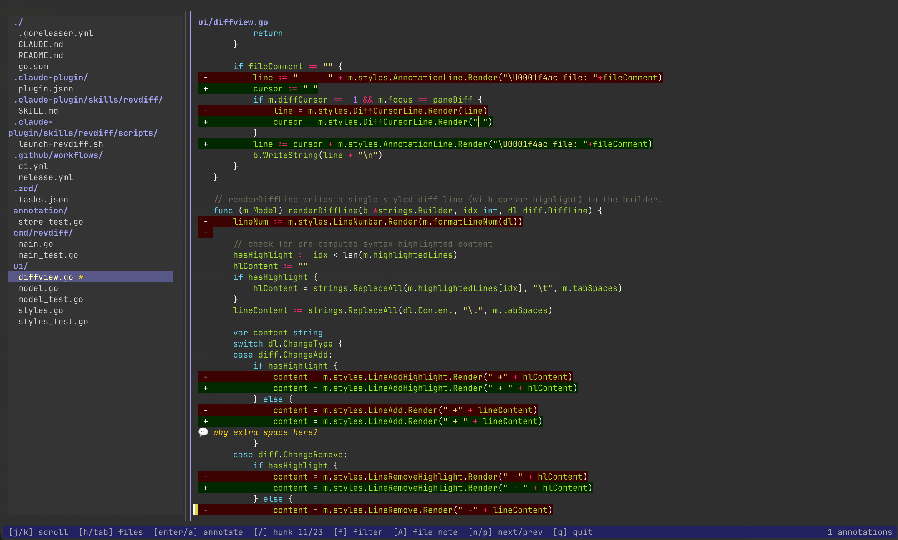

# revdiff [](https://github.com/umputun/revdiff/actions/workflows/ci.yml) [](https://coveralls.io/github/umputun/revdiff?branch=master) [](https://goreportcard.com/report/github.com/umputun/revdiff)

Lightweight TUI for reviewing git diffs with inline annotations. Outputs structured annotations to stdout on quit, making it easy to pipe results into AI agents, scripts, or other tools.

Built for a specific use case: reviewing code changes without leaving a terminal-based AI coding session (e.g., Claude Code). Just enough UI to navigate a full-file diff, annotate specific lines, and return the results to the calling process - no more, no less.

## Features

- Structured annotation output to stdout - pipe into AI agents, scripts, or other tools
- Full-file diff view with syntax highlighting
- Annotate any line in the diff (added, removed, or context) plus file-level notes
- Two-pane TUI: file tree (left) + colorized diff viewport (right)
- Hunk navigation to jump between change groups
- Filter file tree to show only annotated files
- Fully customizable colors via environment variables, CLI flags, or config file



## Requirements

- `git` (used to generate diffs)

## Installation

**Homebrew (macOS/Linux):**

```bash
brew install umputun/apps/revdiff
```

**Go install:**

```bash
go install github.com/umputun/revdiff/cmd/revdiff@latest
```

**Binary releases:** download from [GitHub Releases](https://github.com/umputun/revdiff/releases) (deb, rpm, archives for linux/darwin amd64/arm64).

## Claude Code Plugin

revdiff ships with a Claude Code plugin for interactive code review directly from a Claude session. The plugin launches revdiff as a terminal overlay, captures annotations, and feeds them back to Claude for processing.

The plugin requires one of the following terminals since Claude Code itself cannot display interactive TUI applications - the overlay runs revdiff in a separate terminal layer on top of the current session:

| Terminal | Overlay method | Detection |
|----------|---------------|-----------|
| **tmux** | `display-popup` (blocks until quit) | `$TMUX` env var |
| **kitty** | `kitty @ launch --type=overlay` | `$KITTY_LISTEN_ON` env var |
| **wezterm** | `wezterm cli split-pane` | `$WEZTERM_PANE` env var |

Priority: tmux → kitty → wezterm (first detected wins). If none are available, the plugin exits with an error.

**Install:**

```bash
# add marketplace and install
/plugin marketplace add umputun/revdiff
/plugin install revdiff@umputun-revdiff
```

**Use with `/revdiff` command:**

```
/revdiff                  -- smart detection: uncommitted, last commit, or branch diff
/revdiff HEAD~1           -- review last commit
/revdiff main             -- review current branch against main
/revdiff --staged         -- review staged changes only
/revdiff HEAD~3           -- review last 3 commits
```

**Use with free text** (no slash command needed):

```
"review diff"                     -- smart detection, same as /revdiff
"review diff HEAD~1"              -- last commit
"review diff against main"        -- branch diff
"review changes from last 2 days" -- Claude resolves the ref automatically
"revdiff for staged changes"      -- staged only
```

When no ref is provided, the plugin detects what to review automatically:
- On main/master with uncommitted changes — reviews uncommitted changes
- On main/master with clean tree — reviews the last commit
- On a feature branch with clean tree — reviews branch diff against main
- On a feature branch with uncommitted changes — asks whether to review uncommitted only or the full branch diff

The plugin includes built-in reference documentation and can answer questions about revdiff usage, available themes, keybindings, and configuration options. It can also create or modify the local config file (`~/.config/revdiff/config`) on request:

```
"what chroma themes does revdiff support?"
"switch revdiff to dracula theme"
"what are the revdiff keybindings?"
"set tree width to 3 in revdiff config"
```

The plugin supports the full review loop: annotate → plan → fix → re-review until no more annotations remain.

### Integration with Other Tools

The structured stdout output works with any tool that can read text:

```bash
# capture annotations for processing
annotations=$(revdiff main)
if [ -n "$annotations" ]; then
  echo "$annotations" | your-tool
fi
```

## Usage

```
revdiff [OPTIONS] [ref]
```

### Options

| Option | Description | Default |
|--------|-------------|---------|
| `ref` | Git ref to diff against | uncommitted changes |
| `--staged` | Show staged changes, env: `REVDIFF_STAGED` | `false` |
| `--tree-width` | File tree panel width in units (1-10), env: `REVDIFF_TREE_WIDTH` | `2` |
| `--tab-width` | Number of spaces per tab character, env: `REVDIFF_TAB_WIDTH` | `4` |
| `--no-colors` | Disable all colors including syntax highlighting, env: `REVDIFF_NO_COLORS` | `false` |
| `--no-status-bar` | Hide the status bar, env: `REVDIFF_NO_STATUS_BAR` | `false` |
| `--no-confirm-discard` | Skip confirmation when discarding annotations with Q, env: `REVDIFF_NO_CONFIRM_DISCARD` | `false` |
| `--chroma-style` | Chroma color theme for syntax highlighting, env: `REVDIFF_CHROMA_STYLE` | `catppuccin-macchiato` |
| `-o`, `--output` | Write annotations to file instead of stdout, env: `REVDIFF_OUTPUT` | |
| `--config` | Path to config file, env: `REVDIFF_CONFIG` | `~/.config/revdiff/config` |
| `--dump-config` | Print default config to stdout and exit | |
| `-V`, `--version` | Show version info | |

### Config File

All options can be set in a config file at `~/.config/revdiff/config` (INI format). CLI flags and environment variables override config file values.

Generate a default config file:

```bash
mkdir -p ~/.config/revdiff
revdiff --dump-config > ~/.config/revdiff/config
```

Then uncomment and edit the values you want to change.

<details>
<summary>Color customization flags (click to expand)</summary>

All color options accept hex values (`#rrggbb`) and have corresponding `REVDIFF_COLOR_*` env vars.

| Option | Description | Default |
|--------|-------------|---------|
| `--color-accent` | Active pane borders and directory names | `#D5895F` |
| `--color-border` | Inactive pane borders | `#585858` |
| `--color-normal` | File entries and context lines | `#d0d0d0` |
| `--color-muted` | Divider lines and status bar | `#6c6c6c` |
| `--color-selected-fg` | Selected file text | `#ffffaf` |
| `--color-selected-bg` | Selected file background | `#D5895F` |
| `--color-annotation` | Annotation text and markers | `#ffd700` |
| `--color-cursor-fg` | Cursor indicator color | `#bbbb44` |
| `--color-cursor-bg` | Cursor indicator background | terminal default |
| `--color-add-fg` | Added line text | `#87d787` |
| `--color-add-bg` | Added line background | `#123800` |
| `--color-remove-fg` | Removed line text | `#ff8787` |
| `--color-remove-bg` | Removed line background | `#4D1100` |
| `--color-tree-bg` | File tree pane background | terminal default |
| `--color-diff-bg` | Diff pane background | terminal default |
| `--color-status-fg` | Status bar foreground | `#2D2D2D` |
| `--color-status-bg` | Status bar background | `#C5794F` |

</details>

<details>
<summary>Available chroma styles (click to expand)</summary>

**Dark themes:** `aura-theme-dark`, `aura-theme-dark-soft`, `base16-snazzy`, `catppuccin-frappe`, `catppuccin-macchiato` (default), `catppuccin-mocha`, `doom-one`, `doom-one2`, `dracula`, `evergarden`, `fruity`, `github-dark`, `gruvbox`, `hrdark`, `monokai`, `modus-vivendi`, `native`, `nord`, `nordic`, `onedark`, `paraiso-dark`, `rose-pine`, `rose-pine-moon`, `rrt`, `solarized-dark`, `solarized-dark256`, `tokyonight-moon`, `tokyonight-night`, `tokyonight-storm`, `vim`, `vulcan`, `witchhazel`, `xcode-dark`

**Light themes:** `autumn`, `borland`, `catppuccin-latte`, `colorful`, `emacs`, `friendly`, `github`, `gruvbox-light`, `igor`, `lovelace`, `manni`, `modus-operandi`, `monokailight`, `murphy`, `paraiso-light`, `pastie`, `perldoc`, `pygments`, `rainbow_dash`, `rose-pine-dawn`, `solarized-light`, `tango`, `tokyonight-day`, `trac`, `vs`, `xcode`

**Other:** `RPGLE`, `abap`, `algol`, `algol_nu`, `arduino`, `ashen`, `average`, `bw`, `hr_high_contrast`, `onesenterprise`, `swapoff`

</details>

### Examples

```bash
# review uncommitted changes
revdiff

# review changes against a branch
revdiff main

# review staged changes
revdiff --staged

# review last commit
revdiff HEAD~1
```

### Key Bindings

**Navigation:**

| Key | Action |
|-----|--------|
| `j/k` or up/down | Navigate files (tree) / scroll diff (diff pane) |
| `h/l` | Switch between file tree and diff pane |
| left/right | Horizontal scroll in diff pane |
| `Tab` | Switch between file tree and diff pane |
| `PgDown/PgUp` | Page scroll in file tree and diff pane |
| `Ctrl+d/Ctrl+u` | Page scroll in file tree and diff pane |
| `Home/End` | Jump to first/last item |
| `Enter` | Switch to diff pane (tree) / start annotation (diff pane) |
| `n/p` | Next/previous changed file |
| `[` / `]` | Jump to previous/next change hunk in diff |

**Annotations:**

| Key | Action |
|-----|--------|
| `a` or `Enter` (diff pane) | Annotate current diff line |
| `A` | Add file-level annotation (stored at top of diff) |
| `d` | Delete annotation under cursor |
| `Esc` | Cancel annotation input |

**View:**

| Key | Action |
|-----|--------|
| `f` | Toggle filter: all files / annotated only (shown when annotations exist) |
| `q` | Quit, output annotations to stdout |
| `Q` | Discard all annotations and quit (confirms if annotations exist) |

### Output Format

```
## handler.go (file-level)
consider splitting this file into smaller modules

## handler.go:43 (+)
use errors.Is() instead of direct comparison

## store.go:18 (-)
don't remove this validation
```

## Contributing

See [CONTRIBUTING.md](CONTRIBUTING.md) for details.

## License

MIT License - see [LICENSE](LICENSE) file for details.
