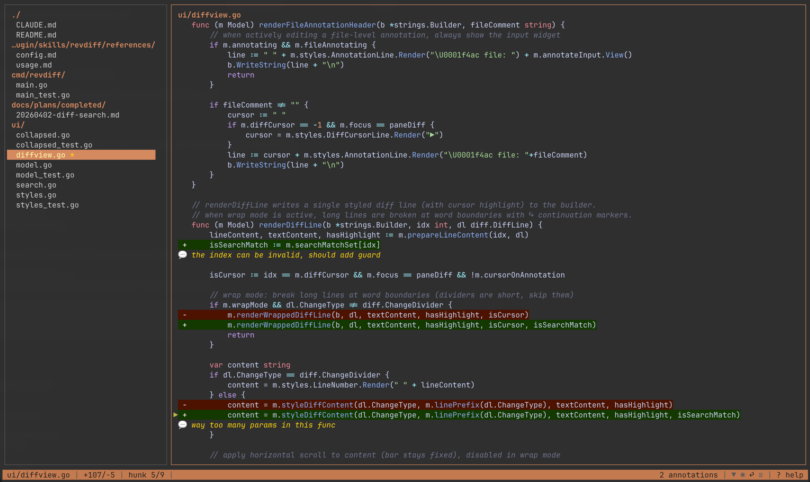

<p align="center">
  
</p>

<p align="center">
  <a href="https://github.com/umputun/revdiff/actions/workflows/ci.yml"></a>
  <a href="https://coveralls.io/github/umputun/revdiff?branch=master"></a>
  <a href="https://goreportcard.com/report/github.com/umputun/revdiff"></a>
</p>

<h1 align="center">revdiff</h1>

Lightweight TUI for reviewing git diffs with inline annotations. Outputs structured annotations to stdout on quit, making it easy to pipe results into AI agents, scripts, or other tools.

Built for a specific use case: reviewing code changes without leaving a terminal-based AI coding session (e.g., Claude Code). Just enough UI to navigate a full-file diff, annotate specific lines, and return the results to the calling process - no more, no less.

## Features

- Structured annotation output to stdout - pipe into AI agents, scripts, or other tools
- Full-file diff view with syntax highlighting
- Collapsed diff mode: shows final text with change markers, toggle with `v`
- Word wrap mode: wraps long lines at viewport boundary with `↪` continuation markers, toggle with `w`
- Annotate any line in the diff (added, removed, or context) plus file-level notes
- Single-file auto-detection: when a diff contains exactly one file, hides the tree pane and gives full terminal width to the diff view
- Two-pane TUI: file tree (left) + colorized diff viewport (right)
- Vim-style `/` search within diff with `n`/`N` match navigation
- Hunk navigation to jump between change groups
- Annotation list popup (`@`): browse all annotations across files, jump to any annotation
- Filter file tree to show only annotated files
- Status line with filename, diff stats, hunk position, and mode indicators
- Help overlay (`?`) showing all keybindings organized by section
- Markdown TOC navigation: single-file markdown files in context-only mode show a table-of-contents pane with header navigation and active section tracking
- No-git file review: `--only` files outside a git repo (or not in any diff) are shown as context-only with full annotation support
- Fully customizable colors via environment variables, CLI flags, or config file



## Requirements

- `git` (used to generate diffs; optional when using `--only` for standalone file review)

## Installation

**Homebrew (macOS/Linux):**

```bash
brew install umputun/apps/revdiff
```

**Go install:**

```bash
go install github.com/umputun/revdiff/cmd/revdiff@latest
```

**Binary releases:** download from [GitHub Releases](https://github.com/umputun/revdiff/releases) (deb, rpm, archives for linux/darwin amd64/arm64).

## Claude Code Plugin

revdiff ships with a Claude Code plugin for interactive code review directly from a Claude session. The plugin launches revdiff as a terminal overlay, captures annotations, and feeds them back to Claude for processing.

The plugin requires one of the following terminals since Claude Code itself cannot display interactive TUI applications - the overlay runs revdiff in a separate terminal layer on top of the current session:

| Terminal | Overlay method | Detection |
|----------|---------------|-----------|
| **tmux** | `display-popup` (blocks until quit) | `$TMUX` env var |
| **kitty** | `kitty @ launch --type=overlay` | `$KITTY_LISTEN_ON` env var |
| **wezterm** | `wezterm cli split-pane` | `$WEZTERM_PANE` env var |

Priority: tmux → kitty → wezterm (first detected wins). If none are available, the plugin exits with an error.

**Install:**

```bash
# add marketplace and install
/plugin marketplace add umputun/revdiff
/plugin install revdiff@umputun-revdiff
```

**Use with `/revdiff` command:**

```
/revdiff                  -- smart detection: uncommitted, last commit, or branch diff
/revdiff HEAD~1           -- review last commit
/revdiff main             -- review current branch against main
/revdiff --staged         -- review staged changes only
/revdiff HEAD~3           -- review last 3 commits
```

**Use with free text** (no slash command needed):

```
"review diff"                     -- smart detection, same as /revdiff
"review diff HEAD~1"              -- last commit
"review diff against main"        -- branch diff
"review changes from last 2 days" -- Claude resolves the ref automatically
"revdiff for staged changes"      -- staged only
```

When no ref is provided, the plugin detects what to review automatically:
- On main/master with uncommitted changes — reviews uncommitted changes
- On main/master with clean tree — reviews the last commit
- On a feature branch with clean tree — reviews branch diff against main
- On a feature branch with uncommitted changes — asks whether to review uncommitted only or the full branch diff

The plugin includes built-in reference documentation and can answer questions about revdiff usage, available themes, keybindings, and configuration options. It can also create or modify the local config file (`~/.config/revdiff/config`) on request:

```
"what chroma themes does revdiff support?"
"switch revdiff to dracula theme"
"what are the revdiff keybindings?"
"set tree width to 3 in revdiff config"
```

The plugin supports the full review loop: annotate → plan → fix → re-review until no more annotations remain.

### Plan Review Plugin

A separate `revdiff-planning` plugin automatically opens revdiff when Claude exits plan mode, letting you annotate the plan before approving it. If you add annotations, Claude revises the plan and asks again — looping until you're satisfied.

```bash
/plugin install revdiff-planning@umputun-revdiff
```

This plugin is independent from the main `revdiff` plugin and does not conflict with other planning plugins (e.g., `planning` from `cc-thingz`).

### Integration with Other Tools

The structured stdout output works with any tool that can read text:

```bash
# capture annotations for processing
annotations=$(revdiff main)
if [ -n "$annotations" ]; then
  echo "$annotations" | your-tool
fi
```

## Usage

```
revdiff [OPTIONS] [base] [against]
```

Positional arguments support several forms:
- `revdiff` — uncommitted changes
- `revdiff HEAD~3` — diff a single ref against the working tree
- `revdiff main feature` — diff between two refs
- `revdiff main..feature` — same as above, using git's dot-dot syntax
- `revdiff main...feature` — changes since `feature` diverged from `main`

### Options

| Option | Description | Default |
|--------|-------------|---------|
| `base` | Git ref to diff against | uncommitted changes |
| `against` | Second git ref for two-ref diff | |
| `--staged` | Show staged changes, env: `REVDIFF_STAGED` | `false` |
| `--tree-width` | File tree panel width in units (1-10), env: `REVDIFF_TREE_WIDTH` | `2` |
| `--tab-width` | Number of spaces per tab character, env: `REVDIFF_TAB_WIDTH` | `4` |
| `--no-colors` | Disable all colors including syntax highlighting, env: `REVDIFF_NO_COLORS` | `false` |
| `--no-status-bar` | Hide the status bar, env: `REVDIFF_NO_STATUS_BAR` | `false` |
| `--wrap` | Enable line wrapping in diff view, env: `REVDIFF_WRAP` | `false` |
| `--collapsed` | Start in collapsed diff mode, env: `REVDIFF_COLLAPSED` | `false` |
| `--no-confirm-discard` | Skip confirmation when discarding annotations with Q, env: `REVDIFF_NO_CONFIRM_DISCARD` | `false` |
| `--chroma-style` | Chroma color theme for syntax highlighting, env: `REVDIFF_CHROMA_STYLE` | `catppuccin-macchiato` |
| `-F`, `--only` | Show only matching files by exact path or suffix, may be repeated (e.g. `--only=model.go`) | |
| `-o`, `--output` | Write annotations to file instead of stdout, env: `REVDIFF_OUTPUT` | |
| `--config` | Path to config file, env: `REVDIFF_CONFIG` | `~/.config/revdiff/config` |
| `--dump-config` | Print default config to stdout and exit | |
| `-V`, `--version` | Show version info | |

### Config File

All options can be set in a config file at `~/.config/revdiff/config` (INI format). CLI flags and environment variables override config file values.

Generate a default config file:

```bash
mkdir -p ~/.config/revdiff
revdiff --dump-config > ~/.config/revdiff/config
```

Then uncomment and edit the values you want to change.

<details>
<summary>Color customization flags (click to expand)</summary>

All color options accept hex values (`#rrggbb`) and have corresponding `REVDIFF_COLOR_*` env vars.

| Option | Description | Default |
|--------|-------------|---------|
| `--color-accent` | Active pane borders and directory names | `#D5895F` |
| `--color-border` | Inactive pane borders | `#585858` |
| `--color-normal` | File entries and context lines | `#d0d0d0` |
| `--color-muted` | Divider lines and status bar | `#585858` |
| `--color-selected-fg` | Selected file text | `#ffffaf` |
| `--color-selected-bg` | Selected file background | `#D5895F` |
| `--color-annotation` | Annotation text and markers | `#ffd700` |
| `--color-cursor-fg` | Cursor indicator color | `#bbbb44` |
| `--color-cursor-bg` | Cursor indicator background | terminal default |
| `--color-add-fg` | Added line text | `#87d787` |
| `--color-add-bg` | Added line background | `#123800` |
| `--color-remove-fg` | Removed line text | `#ff8787` |
| `--color-remove-bg` | Removed line background | `#4D1100` |
| `--color-modify-fg` | Modified line text (collapsed mode) | `#f5c542` |
| `--color-modify-bg` | Modified line background (collapsed mode) | `#3D2E00` |
| `--color-tree-bg` | File tree pane background | terminal default |
| `--color-diff-bg` | Diff pane background | terminal default |
| `--color-status-fg` | Status bar foreground | `#202020` |
| `--color-status-bg` | Status bar background | `#C5794F` |
| `--color-search-fg` | Search match text | `#1a1a1a` |
| `--color-search-bg` | Search match background | `#4a4a00` |

</details>

<details>
<summary>Available chroma styles (click to expand)</summary>

**Dark themes:** `aura-theme-dark`, `aura-theme-dark-soft`, `base16-snazzy`, `catppuccin-frappe`, `catppuccin-macchiato` (default), `catppuccin-mocha`, `doom-one`, `doom-one2`, `dracula`, `evergarden`, `fruity`, `github-dark`, `gruvbox`, `hrdark`, `monokai`, `modus-vivendi`, `native`, `nord`, `nordic`, `onedark`, `paraiso-dark`, `rose-pine`, `rose-pine-moon`, `rrt`, `solarized-dark`, `solarized-dark256`, `tokyonight-moon`, `tokyonight-night`, `tokyonight-storm`, `vim`, `vulcan`, `witchhazel`, `xcode-dark`

**Light themes:** `autumn`, `borland`, `catppuccin-latte`, `colorful`, `emacs`, `friendly`, `github`, `gruvbox-light`, `igor`, `lovelace`, `manni`, `modus-operandi`, `monokailight`, `murphy`, `paraiso-light`, `pastie`, `perldoc`, `pygments`, `rainbow_dash`, `rose-pine-dawn`, `solarized-light`, `tango`, `tokyonight-day`, `trac`, `vs`, `xcode`

**Other:** `RPGLE`, `abap`, `algol`, `algol_nu`, `arduino`, `ashen`, `average`, `bw`, `hr_high_contrast`, `onesenterprise`, `swapoff`

</details>

### Examples

```bash
# review uncommitted changes
revdiff

# review changes against a branch
revdiff main

# review staged changes
revdiff --staged

# review last commit
revdiff HEAD~1

# diff between two refs
revdiff main feature

# same with git dot-dot syntax
revdiff main..feature

# review only specific files
revdiff --only=model.go --only=README.md

# review a file outside a git repo (context-only, no diff markers)
revdiff --only=/tmp/plan.md

# review a file that has no git changes (context-only view with annotations)
revdiff --only=docs/notes.txt
```

### Context-Only File Review

When `--only` specifies a file that has no git changes (or when no git repo exists at all), revdiff shows the file in context-only mode: all lines are displayed without `+`/`-` gutter markers, with full annotation and syntax highlighting support. This enables reviewing arbitrary files without requiring git context.

Two scenarios trigger this mode:

1. **Inside a git repo** - `--only` files not in the diff are read from disk and shown alongside any changed files
2. **Outside a git repo** - `--only` is required; files are read directly from disk

### Markdown TOC Navigation

When reviewing a single markdown file in context-only mode (e.g., `revdiff --only=README.md`), revdiff shows a table-of-contents pane on the left listing all markdown headers. Use `Tab` to switch focus between the TOC and diff panes, `j`/`k` to navigate headers, and `Enter` to jump to a header in the diff. The TOC automatically highlights the current section as you scroll through the file.

This mode activates when all three conditions are met: single file, markdown extension (`.md`/`.markdown`), and all lines are context (no diff changes). Headers inside fenced code blocks are excluded from the TOC.

### Key Bindings

**Navigation:**

| Key | Action |
|-----|--------|
| `j/k` or up/down | Navigate files (tree) / scroll diff (diff pane) |
| `h/l` | Switch between file tree and diff pane |
| left/right | Horizontal scroll in diff pane |
| `Tab` | Switch between file tree and diff pane |
| `PgDown/PgUp` | Page scroll in file tree and diff pane |
| `Ctrl+d/Ctrl+u` | Page scroll in file tree and diff pane |
| `Home/End` | Jump to first/last item |
| `Enter` | Switch to diff pane (tree) / start annotation (diff pane) |
| `n/p` | Next/previous changed file; next/prev header in markdown TOC mode (n = next match when search active) |
| `[` / `]` | Jump to previous/next change hunk in diff |

**Search:**

| Key | Action |
|-----|--------|
| `/` | Start search in diff pane |
| `n` | Next search match (overrides next file when search active) |
| `N` | Previous search match |
| `Esc` | Cancel search input / clear search results |

**Annotations:**

| Key | Action |
|-----|--------|
| `a` or `Enter` (diff pane) | Annotate current diff line |
| `A` | Add file-level annotation (stored at top of diff) |
| `@` | Toggle annotation list popup (navigate and jump to any annotation) |
| `d` | Delete annotation under cursor |
| `Esc` | Cancel annotation input |

**View:**

| Key | Action |
|-----|--------|
| `v` | Toggle collapsed diff mode (shows final text with change markers) |
| `w` | Toggle word wrap (long lines wrap with `↪` continuation markers) |
| `t` | Toggle tree/TOC pane visibility (gives diff full terminal width) |
| `.` | Expand/collapse individual hunk under cursor (collapsed mode only) |
| `f` | Toggle filter: all files / annotated only (shown when annotations exist) |
| `?` | Toggle help overlay showing all keybindings |
| `q` | Quit, output annotations to stdout |
| `Q` | Discard all annotations and quit (confirms if annotations exist) |

### Output Format

```
## handler.go (file-level)
consider splitting this file into smaller modules

## handler.go:43 (+)
use errors.Is() instead of direct comparison

## store.go:18 (-)
don't remove this validation
```

## Contributing

See [CONTRIBUTING.md](CONTRIBUTING.md) for details.

## License

MIT License - see [LICENSE](LICENSE) file for details.
