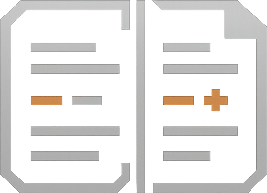

# &nbsp;revdiff &nbsp;<a href="https://github.com/umputun/revdiff/actions/workflows/ci.yml"></a> <a href="https://coveralls.io/github/umputun/revdiff?branch=master"></a> <a href="https://goreportcard.com/report/github.com/umputun/revdiff"></a>

TUI for reviewing diffs, files, and documents with inline annotations. Outputs structured annotations to stdout on quit, making it easy to pipe results into AI agents, scripts, or other tools.

Built for a specific use case: reviewing code changes, plans, and documents without leaving a terminal-based AI coding session (e.g., Claude Code). Just enough UI to navigate diffs and files, annotate specific lines, and return the results to the calling process - no more, no less.

## Features

- Structured annotation output to stdout - pipe into AI agents, scripts, or other tools
- Full-file diff view with syntax highlighting
- Intra-line word-diff: highlights the specific changed words within paired add/remove lines using a brighter background overlay, off by default — enable with `--word-diff` or toggle with `W`
- Collapsed diff mode: shows final text with change markers, toggle with `v`
- Word wrap mode: wraps long lines at viewport boundary with `↪` continuation markers, toggle with `w`
- Horizontal scroll overflow indicators: truncated diff lines show `«` / `»` markers at the edges to signal hidden content off-screen
- Vertical scrollbar thumb: a thicker `┃` segment on pane right borders indicates the visible portion of long diffs, file trees, and markdown TOCs; thumb size and position track scroll progress automatically
- Line numbers: side-by-side old/new line number gutter for diffs, single column for full-context files, toggle with `L`
- Mercurial support: auto-detects hg repos, translates git-style refs (HEAD, HEAD~N) to Mercurial revsets
- Jujutsu support: auto-detects jj repos (including colocated git+jj), translates git-style refs to jj revsets (`HEAD` → `@-`, `HEAD~N` → `@` plus N+1 dashes); `--all-files` supported
- Blame gutter: shows author name and commit age per line, toggle with `B`
- Annotate any line in the diff (added, removed, or context) plus file-level notes
- Single-file auto-detection: when a diff contains exactly one file, hides the tree pane and gives full terminal width to the diff view
- Two-pane TUI: file tree (left) + colorized diff viewport (right)
- Vim-style `/` search within diff with `n`/`N` match navigation
- Hunk navigation to jump between change groups
- Annotation list popup (`@`): browse all annotations across files, jump to any annotation
- Filter file tree to show only annotated files
- Status line with filename, diff stats, hunk position, line number, and mode indicators
- Help overlay (`?`) showing all keybindings organized by section
- Commit info popup (`i`) showing subject + body of every commit in the current ref range (git/hg/jj), useful for restoring the narrative context when reviewing PR-style diffs
- Markdown TOC navigation: single-file markdown files in context-only mode show a table-of-contents pane with header navigation and active section tracking
- All-files mode: browse and annotate all tracked files with `--all-files` (git `ls-files` or jj `file list`), filter with `--include` and `--exclude`
- No-VCS file review: `--only` files outside a VCS repo (or not in any diff) are shown as context-only with full annotation support
- Scratch-buffer review: annotate arbitrary piped or redirected text with `--stdin`, optionally naming it with `--stdin-name`
- Pi package: launch revdiff from pi, capture annotations, and keep them visible in a widget and right-side panel until you apply or clear them
- Review history: auto-saves annotations and diffs to `~/.config/revdiff/history/` on quit as a safety net
- Fully customizable colors via environment variables, CLI flags, or config file
- Custom keybindings: remap any key via config file, export defaults with `--dump-keys`


## Requirements

- `git`, `hg`, or `jj` (used to generate diffs; optional when using `--only` or `--stdin`)

## Installation

**Homebrew (macOS/Linux):**

```bash
brew install umputun/apps/revdiff
```

**Arch Linux (AUR):**

```bash
paru -S revdiff
```

**Debian/Ubuntu (.deb):**

```bash
# download the latest .deb for your architecture from GitHub Releases
sudo dpkg -i revdiff_*.deb
```

**RPM-based (Fedora, RHEL, etc.):**

```bash
# download the latest .rpm for your architecture from GitHub Releases
sudo rpm -i revdiff_*.rpm
```

**Binary releases:** download from [GitHub Releases](https://github.com/umputun/revdiff/releases) (deb, rpm, archives for linux/darwin amd64/arm64).

## Claude Code Plugin

revdiff ships with a Claude Code plugin for interactive code review directly from a Claude session. The plugin launches revdiff as a terminal overlay, captures annotations, and feeds them back to Claude for processing.

The plugin requires one of the following terminals since Claude Code itself cannot display interactive TUI applications - the overlay runs revdiff in a separate terminal layer on top of the current session:

| Terminal | Overlay method | Detection |
|----------|---------------|-----------|
| **tmux** | `display-popup` (blocks until quit) | `$TMUX` env var |
| **Zellij** | `zellij run --floating` | `$ZELLIJ` env var |
| **kitty** | `kitty @ launch --type=overlay` | `$KITTY_LISTEN_ON` env var |
| **wezterm** | `wezterm cli split-pane` | `$WEZTERM_PANE` env var |
| **Kaku** | `kaku cli split-pane` (same API as wezterm) | `$WEZTERM_PANE` env var |
| **cmux** | `cmux new-split` + `cmux send` | `$CMUX_SURFACE_ID` env var |
| **ghostty** | AppleScript split + zoom (macOS only) | `$TERM_PROGRAM` + AppleScript probe |
| **iTerm2** | `osascript` split pane (macOS only) | `$ITERM_SESSION_ID` env var |
| **Emacs vterm** | New frame via `emacsclient` | `$INSIDE_EMACS` env var |

Priority: tmux → Zellij → kitty → wezterm/Kaku → cmux → ghostty → iTerm2 → Emacs vterm (first detected wins). If none are available, the plugin exits with an error.

> **Note:** cmux is detected before ghostty because cmux also sets `$TERM_PROGRAM=ghostty`. The cmux block uses the cmux CLI (`new-split` + `send --surface`) instead of Ghostty's AppleScript API.

> **Note:** iTerm2 uses a split pane (vertical or horizontal, auto-detected from terminal dimensions) rather than a full-screen overlay. The iTerm2 AppleScript API does not expose a zoom command, so the split view shares screen space with the invoking session.

> **Note:** Ghostty and iTerm2 launchers use `osascript` (Apple Events), which is blocked by Claude Code's sandbox. If you use these terminals with sandbox enabled, add the launcher to `excludedCommands` in your Claude Code `settings.json`:
>
> ```json
> {
>   "permissions": {
>     "excludedCommands": ["*/launch-revdiff.sh*"]
>   }
> }
> ```
>
> Terminals that use CLI tools instead of AppleScript (tmux, Zellij, kitty, wezterm, cmux) are not affected.

**Install:**

```bash
# add marketplace and install
/plugin marketplace add umputun/revdiff
/plugin install revdiff@umputun-revdiff
```

**Use with `/revdiff` command:**

```
/revdiff                  -- smart detection: uncommitted, last commit, or branch diff
/revdiff HEAD~1           -- review last commit
/revdiff main             -- review current branch against main
/revdiff --staged         -- review staged changes only
/revdiff HEAD~3           -- review last 3 commits
```

**Use with free text** (no slash command needed):

```
"review diff"                     -- smart detection, same as /revdiff
"review diff HEAD~1"              -- last commit
"review diff against main"        -- branch diff
"review changes from last 2 days" -- Claude resolves the ref automatically
"revdiff for staged changes"      -- staged only
```

When no ref is provided, the plugin auto-detects the VCS (git, hg, or jj) and inspects the current repo state to pick what to review:
- On main/master with uncommitted changes — reviews uncommitted changes
- On main/master with clean tree — reviews the last commit
- On a feature branch with clean tree — reviews branch diff against main
- On a feature branch with uncommitted changes — asks whether to review uncommitted only or the full branch diff
- Outside a VCS repo — falls back to asking the user what to review

The plugin includes built-in reference documentation and can answer questions about revdiff usage, available themes, keybindings, and configuration options. It can also create or modify the local config file (`~/.config/revdiff/config`) on request:

```
"what chroma themes does revdiff support?"
"switch revdiff to dracula theme"
"what are the revdiff keybindings?"
"set tree width to 3 in revdiff config"
```

The plugin supports the full review loop: annotate → plan → fix → re-review until no more annotations remain.

**Custom launchers:** both Claude plugins resolve their launcher script through a two-layer chain (user → bundled), so you can drop a custom launcher at `${CLAUDE_PLUGIN_DATA}/scripts/launch-revdiff.sh` without forking the plugin. There is no project-level (`.claude/...`) override layer by design — the planning hook fires automatically on every `ExitPlanMode`, and a repo-controlled executable layer would let an untrusted repo run arbitrary code on routine Claude actions. See `.claude-plugin/skills/revdiff/references/install.md` for the diff-review skill and [plugins/revdiff-planning/README.md](plugins/revdiff-planning/README.md) for the planning hook.

### Plan Review Plugin

A separate `revdiff-planning` plugin automatically opens revdiff when Claude exits plan mode, letting you annotate the plan before approving it. If you add annotations, Claude revises the plan and asks again — looping until you're satisfied.

```bash
/plugin install revdiff-planning@umputun-revdiff
```

This plugin is independent from the main `revdiff` plugin and does not conflict with other planning plugins (e.g., `planning` from `cc-thingz`).

## Pi Package

revdiff also ships as a [pi](https://github.com/badlogic/pi-mono) package. The extension launches the existing `revdiff` binary, captures annotations on exit, and renders them inside pi as a persistent widget plus a right-side results panel.

**Install:**

```bash
pi install https://github.com/umputun/revdiff
```

**Commands inside pi:**

```text
/revdiff                         -- detect uncommitted, staged, or branch changes, then open revdiff
/revdiff HEAD~1                  -- review last commit
/revdiff --all-files             -- browse all tracked files
/revdiff --only README.md        -- review a single file in context-only mode
/revdiff --pi-overlay            -- use the existing overlay launcher script instead of same-terminal mode
/revdiff-rerun                   -- rerun the last review with remembered args
/revdiff-rerun --pi-overlay      -- rerun the last review in overlay mode
/revdiff-results                 -- reopen the last results panel
/revdiff-apply                   -- insert the last annotations into the pi chat context
/revdiff-clear                   -- clear stored review state
/revdiff-reminders on            -- enable post-edit review reminders
```

**Notes:**

- Requires the `revdiff` binary on `PATH`
- Set `REVDIFF_BIN=/absolute/path/to/revdiff` if pi can't find the binary
- Same-terminal mode is the default: pi temporarily suspends, revdiff takes over the terminal, and pi resumes on exit
- Optional overlay mode (`--pi-overlay` or `REVDIFF_PI_MODE=overlay`) reuses the existing `launch-revdiff.sh` script from the Claude plugin integration; pi invokes the bundled script directly and does not honor Claude-plugin overrides (`CLAUDE_PLUGIN_DATA` is not set in the pi runtime)
- Optional post-edit reminders are available via `/revdiff-reminders on` and suggest running `/revdiff` or `/revdiff-rerun` after agent edits
- In the repo, the pi-specific resources live under `plugins/pi/` to keep harness integrations clearly separated

## Codex Plugin

revdiff ships with a [Codex CLI](https://github.com/openai/codex) plugin for interactive diff review and plan annotation directly from a Codex session. The plugin provides two skills:

- `/revdiff` — same diff review workflow as the Claude Code plugin (detect ref, launch overlay, capture annotations, feedback loop)
- `/revdiff-plan` — extracts the last Codex assistant message from session rollout files, opens it in revdiff for annotation, and feeds feedback back

The plugin uses the same terminal overlay mechanism (tmux, Zellij, kitty, wezterm, etc.) as the Claude Code plugin.

**Install:**

```bash
# clone the repo first
git clone https://github.com/umputun/revdiff.git
cd revdiff

# copy skills to Codex skills directory
cp -r plugins/codex/skills/revdiff ~/.codex/skills/revdiff
cp -r plugins/codex/skills/revdiff-plan ~/.codex/skills/revdiff-plan
```

**Requirements:**

- `revdiff` binary on `PATH`
- `jq` (required for `/revdiff-plan` session extraction)
- One of the supported terminal multiplexers for overlay mode

**Notes:**

- Codex has no hook system — plan review requires manually invoking `/revdiff-plan` after Codex generates a plan
- Scripts are portable copies from the Claude Code plugin, not symlinks
- Plugin source lives under `plugins/codex/` in the repository

### Integration with Other Tools

#### OpenCode

revdiff integrates with [OpenCode](https://github.com/opencode-ai/opencode) via a tool, slash command, and plan-review plugin. The tool wraps the existing `launch-revdiff.sh` launcher, so terminal detection stays in sync automatically.

**Install:**

```bash
cd plugins/opencode && bash setup.sh
```

The setup script copies files to `~/.config/opencode/` and registers the plan-review plugin. See [plugins/opencode/README.md](plugins/opencode/README.md) for manual installation and details.

**Commands inside OpenCode:**

```text
/revdiff                         -- review git diff with revdiff TUI
/revdiff HEAD~3                  -- review last 3 commits
```

The plan-review plugin automatically launches revdiff when the assistant exits plan mode, letting you annotate before approval.

#### General

The structured stdout output works with any tool that can read text:

```bash
# capture annotations for processing
annotations=$(revdiff main)
if [ -n "$annotations" ]; then
  echo "$annotations" | your-tool
fi
```

## Usage

```
revdiff [OPTIONS] [base] [against]
```

Positional arguments support several forms:
- `revdiff` — uncommitted changes
- `revdiff HEAD~3` — diff a single ref against the working tree
- `revdiff main feature` — diff between two refs
- `revdiff main..feature` — same as above, using git's dot-dot syntax
- `revdiff main...feature` — changes since `feature` diverged from `main`

### Options

| Option | Description | Default |
|--------|-------------|---------|
| `base` | Git ref to diff against | uncommitted changes |
| `against` | Second git ref for two-ref diff | |
| `--staged` | Show staged changes, env: `REVDIFF_STAGED` | `false` |
| `--tree-width` | File tree panel width in units (1-10), env: `REVDIFF_TREE_WIDTH` | `2` |
| `--tab-width` | Number of spaces per tab character, env: `REVDIFF_TAB_WIDTH` | `4` |
| `--no-colors` | Disable all colors including syntax highlighting, env: `REVDIFF_NO_COLORS` | `false` |
| `--no-status-bar` | Hide the status bar, env: `REVDIFF_NO_STATUS_BAR` | `false` |
| `--wrap` | Enable line wrapping in diff view, env: `REVDIFF_WRAP` | `false` |
| `--collapsed` | Start in collapsed diff mode, env: `REVDIFF_COLLAPSED` | `false` |
| `--compact` | Start in compact diff mode (small context around changes), env: `REVDIFF_COMPACT` | `false` |
| `--compact-context` | Number of context lines around changes when in compact mode, env: `REVDIFF_COMPACT_CONTEXT` | `5` |
| `--cross-file-hunks` | Allow `[` and `]` to continue into adjacent files, env: `REVDIFF_CROSS_FILE_HUNKS` | `false` |
| `--line-numbers` | Show line numbers in diff gutter, env: `REVDIFF_LINE_NUMBERS` | `false` |
| `--blame` | Show blame gutter on startup, env: `REVDIFF_BLAME` | `false` |
| `--word-diff` | Highlight intra-line word-level changes in paired add/remove lines, env: `REVDIFF_WORD_DIFF` | `false` |
| `--no-confirm-discard` | Skip confirmation when discarding annotations with Q, env: `REVDIFF_NO_CONFIRM_DISCARD` | `false` |
| `--no-mouse` | Disable mouse support (scroll wheel, click), env: `REVDIFF_NO_MOUSE` | `false` |
| `--vim-motion` | Enable vim-style motion preset (counts, `gg`, `G`, `zz`/`zt`/`zb`, `ZZ`/`ZQ`), env: `REVDIFF_VIM_MOTION` | `false` |
| `--chroma-style` | Chroma color theme for syntax highlighting, env: `REVDIFF_CHROMA_STYLE` | `catppuccin-macchiato` |
| `--theme` | Load color theme from `~/.config/revdiff/themes/`, env: `REVDIFF_THEME` | |
| `--dump-theme` | Print currently resolved colors as theme file to stdout and exit | |
| `--list-themes` | Print available theme names to stdout and exit | |
| `--init-themes` | Write bundled theme files to themes dir and exit | |
| `--init-all-themes` | Write all gallery themes (bundled + community) to themes dir and exit | |
| `--install-theme` | Install theme(s) from gallery or local file path and exit (repeatable) | |
| `-A`, `--all-files` | Browse all tracked files, not just diffs (git or jj) | `false` |
| `--stdin` | Review stdin as a scratch buffer (piped or redirected input only) | `false` |
| `--stdin-name` | Synthetic file name for stdin content; enables extension-based highlighting/TOC | `scratch-buffer` |
| `-I`, `--include` | Include only files matching prefix, may be repeated, env: `REVDIFF_INCLUDE` (comma-separated) | |
| `-X`, `--exclude` | Exclude files matching prefix, may be repeated, env: `REVDIFF_EXCLUDE` (comma-separated) | |
| `-F`, `--only` | Show only matching files by exact path or suffix, may be repeated (e.g. `--only=model.go`) | |
| `-o`, `--output` | Write annotations to file instead of stdout, env: `REVDIFF_OUTPUT` | |
| `--annotations` | Preload annotations from a markdown file in `-o` format | |
| `--history-dir` | Directory for review history auto-saves, env: `REVDIFF_HISTORY_DIR` | `~/.config/revdiff/history/` |
| `--config` | Path to config file, env: `REVDIFF_CONFIG` | `~/.config/revdiff/config` |
| `--keys` | Path to keybindings file, env: `REVDIFF_KEYS` | `~/.config/revdiff/keybindings` |
| `--dump-keys` | Print effective keybindings to stdout and exit | |
| `--dump-config` | Print default config to stdout and exit | |
| `-V`, `--version` | Show version info | |

### Config File

All options can be set in a config file at `~/.config/revdiff/config` (INI format). CLI flags and environment variables override config file values.

Generate a default config file:

```bash
mkdir -p ~/.config/revdiff
revdiff --dump-config > ~/.config/revdiff/config
```

Then uncomment and edit the values you want to change.

### Themes

revdiff ships with eight bundled color themes: **basic**, **catppuccin-latte**, **catppuccin-mocha**, **dracula**, **gruvbox**, **nord**, **revdiff**, and **solarized-dark**. Themes are stored in `~/.config/revdiff/themes/` and are automatically created on first run.

Press `T` inside revdiff to open the interactive theme selector with live preview — browse themes, see colors applied instantly, and persist your choice to the config file on confirm.

```bash
# apply a theme
revdiff --theme dracula

# list available themes
revdiff --list-themes

# re-create bundled theme files (overwrites bundled, keeps custom themes)
revdiff --init-themes

# install a specific theme from the gallery
revdiff --install-theme catppuccin-latte

# install all gallery themes (bundled + community)
revdiff --init-all-themes

# export current colors as a custom theme
revdiff --dump-theme > ~/.config/revdiff/themes/my-custom
```

**Creating custom themes** — two approaches:

1. **From current colors:** customize individual colors in your config file or via `--color-*` flags, then dump the resolved result as a theme: `revdiff --dump-theme > ~/.config/revdiff/themes/my-custom`
2. **From scratch:** copy a bundled theme and edit it directly — each file defines all 23 color keys plus `chroma-style` in INI format:

```ini
# name: my-custom
# description: custom color scheme
chroma-style = dracula
color-accent = #bd93f9
color-border = #6272a4
...all 23 color keys...
```

Set a default theme in the config file:

```ini
theme = dracula
```

Or via environment variable: `REVDIFF_THEME=dracula`.

**Contributing themes** — community themes live in the `themes/gallery/` directory. See [themes/README.md](themes/README.md) for the contribution guide, format requirements, and validation instructions.

**Precedence:** When `--theme` is set, it takes over completely — all 23 color fields and chroma-style are overwritten by the theme, ignoring any `--color-*` flags or env vars. Without `--theme`: built-in defaults → config file → env vars → CLI flags. `--theme` + `--no-colors` prints a warning and applies the theme.

<details>
<summary>Color customization flags (click to expand)</summary>

All color options accept hex values (`#rrggbb`) and have corresponding `REVDIFF_COLOR_*` env vars.

| Option | Description | Default |
|--------|-------------|---------|
| `--color-accent` | Active pane borders and directory names | `#D5895F` |
| `--color-border` | Inactive pane borders | `#585858` |
| `--color-normal` | File entries and context lines | `#d0d0d0` |
| `--color-muted` | Divider lines and status bar | `#585858` |
| `--color-selected-fg` | Selected file text | `#ffffaf` |
| `--color-selected-bg` | Selected file background | `#D5895F` |
| `--color-annotation` | Annotation text and markers | `#ffd700` |
| `--color-cursor-fg` | Cursor indicator color | `#bbbb44` |
| `--color-cursor-bg` | Cursor indicator background | terminal default |
| `--color-add-fg` | Added line text | `#87d787` |
| `--color-add-bg` | Added line background | `#123800` |
| `--color-remove-fg` | Removed line text | `#ff8787` |
| `--color-remove-bg` | Removed line background | `#4D1100` |
| `--color-word-add-bg` | Intra-line word-diff add background | auto-derived from add-bg |
| `--color-word-remove-bg` | Intra-line word-diff remove background | auto-derived from remove-bg |
| `--color-modify-fg` | Modified line text (collapsed mode) | `#f5c542` |
| `--color-modify-bg` | Modified line background (collapsed mode) | `#3D2E00` |
| `--color-tree-bg` | File tree pane background | terminal default |
| `--color-diff-bg` | Diff pane background | terminal default |
| `--color-status-fg` | Status bar foreground | `#202020` |
| `--color-status-bg` | Status bar background | `#C5794F` |
| `--color-search-fg` | Search match text | `#1a1a1a` |
| `--color-search-bg` | Search match background | `#4a4a00` |

</details>

<details>
<summary>Available chroma styles (click to expand)</summary>

**Dark themes:** `aura-theme-dark`, `aura-theme-dark-soft`, `base16-snazzy`, `catppuccin-frappe`, `catppuccin-macchiato` (default), `catppuccin-mocha`, `doom-one`, `doom-one2`, `dracula`, `evergarden`, `fruity`, `github-dark`, `gruvbox`, `hrdark`, `monokai`, `modus-vivendi`, `native`, `nord`, `nordic`, `onedark`, `paraiso-dark`, `rose-pine`, `rose-pine-moon`, `rrt`, `solarized-dark`, `solarized-dark256`, `tokyonight-moon`, `tokyonight-night`, `tokyonight-storm`, `vim`, `vulcan`, `witchhazel`, `xcode-dark`

**Light themes:** `autumn`, `borland`, `catppuccin-latte`, `colorful`, `emacs`, `friendly`, `github`, `gruvbox-light`, `igor`, `lovelace`, `manni`, `modus-operandi`, `monokailight`, `murphy`, `paraiso-light`, `pastie`, `perldoc`, `pygments`, `rainbow_dash`, `rose-pine-dawn`, `solarized-light`, `tango`, `tokyonight-day`, `trac`, `vs`, `xcode`

**Other:** `RPGLE`, `abap`, `algol`, `algol_nu`, `arduino`, `ashen`, `average`, `bw`, `hr_high_contrast`, `onesenterprise`, `swapoff`

</details>

### Examples

```bash
# review uncommitted changes
revdiff

# review changes against a branch
revdiff main

# review staged changes
revdiff --staged

# review last commit
revdiff HEAD~1

# diff between two refs
revdiff main feature

# same with git dot-dot syntax
revdiff main..feature

# review only specific files
revdiff --only=model.go --only=README.md

# browse all git-tracked files in a project
revdiff --all-files

# browse all files, excluding vendor and mocks directories
revdiff --all-files --exclude vendor --exclude mocks

# include only src/ files
revdiff --include src

# include src/ but exclude src/vendor/
revdiff --include src --exclude src/vendor

# exclude paths in normal diff mode
revdiff main --exclude vendor

# review a file outside a VCS repo (context-only, no diff markers)
revdiff --only=/tmp/plan.md

# review a file that has no VCS changes (context-only view with annotations)
revdiff --only=docs/notes.txt

# review arbitrary piped text as a scratch buffer
printf '# Plan\n\nShip it\n' | revdiff --stdin --stdin-name plan.md

# capture annotations from generated output
some-command | revdiff --stdin --output /tmp/annotations.txt

# round-trip: capture, edit externally, reload
revdiff -o review.md HEAD~1
$EDITOR review.md
revdiff --annotations=review.md HEAD~1
```

`--annotations` reads the same markdown format that `-o` writes (see [Output Format](#output-format) below), so any file revdiff produces can be loaded back. You can also hand-author or generate that file from any other source — each record is `## path/to/file.go:LINE (+)` followed by the comment body — then step through the comments inline against the actual diff, edit or delete them in the TUI, and quit with `q` to write the final set to stdout (or to `-o`).

### All-Files Mode

Use `--all-files` (or `-A`) to browse all tracked files in a project, not just files with changes. This turns revdiff into a general-purpose code annotation tool. All files are shown in context-only mode (no `+`/`-` markers) with full annotation and syntax highlighting support.

`--all-files` requires a git or jj repository (uses `git ls-files` or `jj file list` for file discovery) and is mutually exclusive with refs, `--staged`, and `--only`. Not supported in hg repos.

Combine with `--include` (or `-I`) to narrow to specific paths and `--exclude` (or `-X`) to filter out unwanted paths:

```bash
revdiff --all-files --include src
revdiff --all-files --include src --exclude src/vendor
revdiff --all-files --exclude vendor --exclude mocks
```

`--include` and `--exclude` both use prefix matching: `--include src` keeps only `src/`, `src/foo.go`, etc. `--exclude vendor` skips `vendor/`, `vendor/foo.go`, etc. Both work in `--all-files` and normal diff modes and are composable: include narrows first, then exclude removes from the included set.

Both options can be persisted in the config file:

```ini
include = src
exclude = vendor
exclude = mocks
```

Or via environment variables (comma-separated): `REVDIFF_INCLUDE=src`, `REVDIFF_EXCLUDE=vendor,mocks`.

### Context-Only File Review

When `--only` specifies a file that has no VCS changes (or when no VCS repo exists at all), revdiff shows the file in context-only mode: all lines are displayed without `+`/`-` gutter markers, with full annotation and syntax highlighting support. This enables reviewing arbitrary files without requiring VCS context.

Two scenarios trigger this mode:

1. **Inside a repo (git/hg/jj)** - `--only` files not in the diff are read from disk and shown alongside any changed files
2. **Outside a VCS repo** - `--only` is required; files are read directly from disk

### Scratch-Buffer Review

Use `--stdin` to review arbitrary piped or redirected text as a single synthetic file. All lines are shown as context, so the normal single-file review flow still works: annotations, file-level notes, search, wrap, collapsed mode, and structured output.

`--stdin` is explicit and mutually exclusive with refs, `--staged`, `--only`, `--all-files`, `--include`, `--exclude`, and `--annotations`. stdin mode requires piped or redirected input; plain terminal stdin is rejected to avoid accidentally launching an empty scratch buffer.

Use `--stdin-name` to control the synthetic filename. This gives annotation output a stable key and enables filename-based syntax highlighting or markdown TOC activation:

```bash
echo "plain text" | revdiff --stdin
printf '# Plan\n\nBody\n' | revdiff --stdin --stdin-name plan.md
git show HEAD~1:README.md | revdiff --stdin --stdin-name README.md
```

### Markdown TOC Navigation

When reviewing a single markdown file in context-only mode (e.g., `revdiff --only=README.md` or `printf '# title\n' | revdiff --stdin --stdin-name plan.md`), revdiff shows a table-of-contents pane on the left listing all markdown headers. Use `Tab` to switch focus between the TOC and diff panes, `j`/`k` to navigate headers, and `Enter` to jump to a header in the diff. The TOC automatically highlights the current section as you scroll through the file.

This mode activates when all three conditions are met: single file, markdown extension (`.md`/`.markdown`), and all lines are context (no diff changes). Headers inside fenced code blocks are excluded from the TOC.

### Beyond Code Review

The `--only` flag enables use cases beyond VCS diffs. Any text file can be loaded for annotation — no VCS repo required.

**Reviewing AI-generated drafts** — When an AI assistant drafts text to be posted publicly (PR comments, issue responses, release notes), write it to a temp file and review in revdiff. Annotate specific lines with changes, the assistant reads annotations and rewrites, re-open to verify. Same annotate-fix-verify loop as code review.

**Reviewing documentation and specs** — Markdown files, API specs, config files, and plan documents can all be reviewed with inline annotations. Useful for reviewing RFCs, annotating configs before deployment, or marking up plans with questions.

```bash
revdiff --only=docs/plans/feature.md
revdiff --only=/tmp/draft-comment.md
```

**Reviewing generated output** — CI configs, Terraform plans, generated migrations, or command output. Load files with `--only` or stream ephemeral output with `--stdin`, annotate what needs fixing, feed annotations back to the generator.

### Zed Integration

Zed's [custom tasks](https://zed.dev/docs/tasks) can launch revdiff directly in an editor terminal tab.

See the [Zed integration guide](https://revdiff.com/docs.html#zed-integration) for ready-to-use task definitions, keybinding setup, and platform-specific clipboard notes.

### Review History

When you quit with annotations (`q`), revdiff automatically saves a copy of the review session to `~/.config/revdiff/history/<repo-name>/<timestamp>.md`. This is a safety net — if annotations are lost (process crash, agent fails to capture stdout), the history file preserves them.

Each history file contains:
- Header with path, refs, and (git only) a short commit hash
- Full annotation output (same format as stdout)
- Raw git diff for annotated files only

History auto-save is always on and silent — errors are logged to stderr, never fail the process. No history is saved on discard quit (`Q`) or when there are no annotations. For `--stdin` mode, files are saved under `stdin/` subdirectory; for `--only` without git, the parent directory name is used instead of a repo name.

Override the history directory with `--history-dir`, `REVDIFF_HISTORY_DIR` env var, or `history-dir` in the config file.

In the Claude Code and Codex plugins, you can also tell the agent to use a past review by saying things like "locate my latest revdiff review" or "use the annotations from the review I just did in another terminal". The plugin reads the newest history file for the current repo via the helper script `read-latest-history.sh` and processes the annotations as if they had come from a fresh launcher call. This is useful for standalone revdiff runs outside the plugin, or when the live launcher output is unavailable (e.g., a broken custom launcher or a crashed agent).

### Key Bindings

**Navigation:**

| Key | Action |
|-----|--------|
| `j/k` or up/down | Navigate files (tree) / scroll diff (diff pane) |
| `h/l` | Switch between file tree and diff pane |
| left/right | Horizontal scroll in diff pane (truncated lines show `«` / `»` overflow indicators at the edges) |
| `Tab` | Switch between file tree and diff pane |
| `PgDown/PgUp` | Page scroll in file tree and diff pane |
| `Ctrl+d/Ctrl+u` | Half-page scroll in file tree and diff pane |
| `Home/End` | Jump to first/last item |
| `Enter` | Switch to diff pane (tree) / start annotation (diff pane) |
| `n/p` | Next/previous changed file; next/prev header in markdown TOC mode (n = next match when search active) |
| `[` / `]` | Jump to previous/next change hunk in diff; add `--cross-file-hunks` to continue into the previous/next file at the boundary |

**Search:**

| Key | Action |
|-----|--------|
| `/` | Start search in diff pane |
| `n` | Next search match (overrides next file when search active) |
| `N` | Previous file (previous search match when searching) |
| `Esc` | Cancel search input / clear search results |

**Annotations:**

| Key | Action |
|-----|--------|
| `a` or `Enter` (diff pane) | Annotate current diff line |
| `A` | Add file-level annotation (stored at top of diff) |
| `@` | Toggle annotation list popup (navigate and jump to any annotation) |
| `d` | Delete annotation under cursor |
| `Ctrl+E` (during annotation input) | Open `$EDITOR` for multi-line annotation |
| `Esc` | Cancel annotation input |

While the annotation input is active, press `Ctrl+E` to hand off the current text to an external editor for multi-line comments. Editor resolution: `$EDITOR` → `$VISUAL` → `vi`. Values with arguments work (e.g. `EDITOR="code --wait"`). On editor save and quit, the full file contents (including newlines) become the annotation. Quitting the editor with an empty file cancels the annotation and preserves any previously stored note on that line. Multi-line annotations are rendered line-by-line in the diff view, shown flattened in the annotation list popup (`@`), and emitted with embedded newlines in the structured output.

**View:**

| Key | Action |
|-----|--------|
| `v` | Toggle collapsed diff mode (shows final text with change markers) |
| `C` | Toggle compact diff view (small context around changes, re-fetches current file) |
| `w` | Toggle word wrap (long lines wrap with `↪` continuation markers) |
| `t` | Toggle tree/TOC pane visibility (gives diff full terminal width) |
| `L` | Toggle line numbers (side-by-side old/new for diffs, single column for full-context files) |
| `B` | Toggle blame gutter (author name + commit age per line) |
| `W` | Toggle intra-line word-diff highlighting for paired add/remove lines |
| `.` | Expand/collapse individual hunk under cursor (collapsed mode only) |
| `T` | Open theme selector with live preview |
| `f` | Toggle filter: all files / annotated only (shown when annotations exist) |
| `?` | Toggle help overlay showing all keybindings |
| `i` | Toggle commit info popup (subject + body of commits in the current ref range; git/hg/jj only) |
| `R` | Reload diff from VCS (warns if annotations exist) |
| `q` | Quit, output annotations to stdout |
| `Q` | Discard all annotations and quit (confirms if annotations exist) |

### Status Bar Icons

The status bar shows a fixed row of mode indicators on the right side. All slots are always rendered — active modes use the status bar foreground color, inactive modes use muted gray, so the row occupies the same width regardless of what's toggled on.

| Icon | Toggle | Meaning |
|------|--------|---------|
| `▼` | `v` | Collapsed diff mode |
| `⊂` | `C` | Compact diff mode (small context around changes) |
| `◉` | `f` | Filter: annotated files only |
| `↩` | `w` | Word wrap mode |
| `≋` | `/` | Search active |
| `⊟` | `t` | Tree/TOC pane hidden (diff uses full width) |
| `#` | `L` | Line numbers visible in gutter |
| `b` | `B` | Blame gutter visible |
| `±` | `W` | Intra-line word-diff highlighting |
| `✓` | `Space` | Reviewed count (increments when a file is marked reviewed) |
| `∅` | `u` | Untracked files visible in tree |

On narrow terminals, the left-hand segments are dropped before the icons: search position first, then line and hunk info, then the filename truncates. The icon row on the right stays put.

### Mouse Support

revdiff enables mouse tracking by default so the scroll wheel and left-click work consistently across terminals.

- **Scroll wheel**: scrolls whichever pane the cursor is over (tree/TOC or diff). Three lines per notch.
- **Shift+scroll**: half-page scroll in whichever pane the cursor is over.
- **Left-click in the tree**: focuses the tree and selects/loads the clicked entry (same as pressing `j`/`k` to land there). Clicking a directory row moves the cursor but does not load a file.
- **Left-click in the diff**: focuses the diff and moves the cursor to the clicked line. Enables a "click, then `a`" annotation flow.
- **Left-click in the TOC pane** (single-file markdown): focuses the TOC and selects the clicked header.
- **Scroll wheel in overlay popups** (commit info, annotations, themes): scrolls the popup content or moves its cursor. Shift+wheel uses a half-page step. In the theme selector, wheel previews each theme live. Help overlay has no scrollable or selectable content so mouse events are ignored.
- **Left-click in the annotation popup**: jumps to the clicked annotation (same as pressing `Enter`).
- **Left-click in the theme popup**: confirms the clicked theme (same as pressing `Enter`). Clicks on the filter row or blank separator are ignored.

Horizontal wheel, right-click, middle-click, drag selection, and clicks on the status bar or diff header are intentionally ignored. Clicks outside an open overlay are swallowed — dismiss an overlay with `Esc` or its toggle key. Modal states (annotation input, search input, confirm discard, reload confirm) swallow mouse events entirely.

**Text selection trade-off** — once mouse tracking is on, plain drag is captured by revdiff. For terminal-native text selection:

- **kitty**: hold `Ctrl+Shift` while dragging
- **iTerm2**: hold `Option` while dragging
- **most other terminals**: hold `Shift` while dragging

Because the tree pane is rendered alongside the diff on the same rows, multi-line Shift+drag will include tree content. For clean copies of diff text, use your terminal's block-select mode (Option+drag in iTerm2, Ctrl+Shift+drag in kitty) or run with `--no-mouse` to disable mouse capture entirely.

Opt out with `--no-mouse`, `REVDIFF_NO_MOUSE=true`, or `no-mouse = true` in the config file.

### Custom Keybindings

All keybindings can be customized via a keybindings file at `~/.config/revdiff/keybindings`. Override the path with `--keys` flag or `REVDIFF_KEYS` env var.

The file uses a simple `map`/`unmap` format (blank lines and `#` comments are ignored):

```
# ~/.config/revdiff/keybindings
map ctrl+d half_page_down
map ctrl+u half_page_up
map x quit
unmap q
```

- `map <key> <action>` — binds a key to an action (additive, defaults are kept unless explicitly unmapped)
- `unmap <key>` — removes a default binding

Generate a template with all current bindings:

```bash
mkdir -p ~/.config/revdiff
revdiff --dump-keys > ~/.config/revdiff/keybindings
```

Then edit to taste. Modal keys (annotation input, search input, confirm discard) are not remappable.

**Chord bindings (ctrl/alt leader):** bind a two-stage chord by joining the leader and second key with `>`. The leader must be a `ctrl+*` or `alt+*` combo; the second stage is any single key. Only two stages are supported.

```
map ctrl+w>x mark_reviewed
map alt+t>n theme_select
```

When the leader is pressed, the status bar shows `Pending: ctrl+w, esc to cancel`; press the second key to dispatch, or `esc` to cancel silently. Binding a key as both a standalone action and a chord prefix drops the standalone binding (the chord wins, with a warning). Chord bindings work under non-Latin keyboard layouts — the second-stage key is translated via the same layout-resolve fallback as single-key bindings.

**macOS note:** `alt+*` leaders require your terminal to send Option as Meta/Alt. Most terminals default to "Option composes special characters" (e.g. `Option+T` → `†`), in which case Alt chords silently won't fire. To enable: iTerm2 → *Profiles → Keys → Left/Right Option key → `Esc+`*; Terminal.app → *Profiles → Keyboard → Use Option as Meta key*; Kitty → `macos_option_as_alt yes`; Ghostty → `macos-option-as-alt = true`. If you'd rather not touch terminal settings, use `ctrl+*` leaders — those work everywhere with no configuration.

<details>
<summary>Available actions (click to expand)</summary>

**Navigation:** `down`, `up`, `page_down`, `page_up`, `half_page_down`, `half_page_up`, `home`, `end`, `scroll_left`, `scroll_right`, `scroll_center`, `scroll_top`, `scroll_bottom`

**File/Hunk:** `next_item`, `prev_item`, `next_hunk`, `prev_hunk`

**Pane:** `toggle_pane`, `focus_tree`, `focus_diff`

**Search:** `search`

**Annotations:** `confirm` (annotate line / select file), `annotate_file`, `delete_annotation`, `annot_list`

**View:** `toggle_collapsed`, `toggle_compact`, `toggle_wrap`, `toggle_tree`, `toggle_line_numbers`, `toggle_blame`, `toggle_word_diff`, `toggle_hunk`, `toggle_untracked`, `mark_reviewed`, `theme_select`, `filter`, `commit_info`, `reload`

**Quit:** `quit`, `discard_quit`, `help`, `dismiss`

</details>

### Vim-motion Preset

Opt-in vim-style motion layer activated via `--vim-motion`, `REVDIFF_VIM_MOTION=true`, or `vim-motion = true` in the config file. Off by default — when off, existing single-key bindings are unchanged.

| Keys | Action |
|------|--------|
| `<N>j` / `<N>k` | Move cursor N lines down/up (diff pane, 1-9999) |
| `gg` | Jump to first line (diff pane) |
| `G` | Jump to last line (diff pane) |
| `<N>G` | Goto line N (diff pane) |
| `zz` | Center viewport on cursor (diff pane) |
| `zt` | Align viewport top on cursor (diff pane) |
| `zb` | Align viewport bottom on cursor (diff pane) |
| `ZZ` | Quit (any pane) |
| `ZQ` | Discard annotations and quit (any pane) |

When the preset is on, the digits `0`-`9` and the leader keys `g`, `z`, `Z` are intercepted before the regular keymap, so any standalone binding on those keys is overridden while the flag is active. `<N>j`/`<N>k`/`<N>G` and `gg`/`zz`/`zt`/`zb` apply to the diff pane only — in the file tree they fall through to the normal bindings. `ZZ` and `ZQ` work from any pane. Press `Esc` to silently cancel a pending leader; an unknown second key surfaces a transient `Unknown: <chord>` hint in the status bar. A bare digit `0` is not consumed (falls through to whatever binding is mapped); counts over 9999 are clamped. Modal keys (search input, annotation input, overlay navigation) always take precedence over the interceptor, and `ctrl+*`/`alt+*` chord bindings keep working orthogonally.

The help overlay (`?`) shows a dedicated **Vim motion** section listing all eight preset bindings when `--vim-motion` is on; when off, the section is hidden.

### Output Format

```
## handler.go (file-level)
consider splitting this file into smaller modules

## handler.go:43 (+)
use errors.Is() instead of direct comparison

## handler.go:43-67 (+)
refactor this hunk to reduce nesting

## store.go:18 (-)
don't remove this validation
```

When annotation text contains the keyword "hunk" (case-insensitive, whole word), the output header automatically expands to include the full hunk line range (e.g., `handler.go:43-67 (+)` instead of `handler.go:43 (+)`). This gives AI consumers the range context without any extra steps.

Comment body lines starting with `## ` (the record-header form) are prefixed with a single space on output so parsers that split on `## ` record headers cannot confuse a multi-line comment for a new record.

## Contributing

See [CONTRIBUTING.md](CONTRIBUTING.md) for details.

## License

MIT License - see [LICENSE](LICENSE) file for details.
